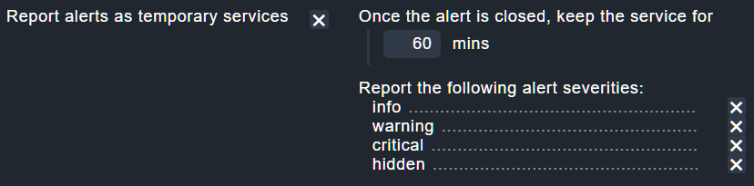
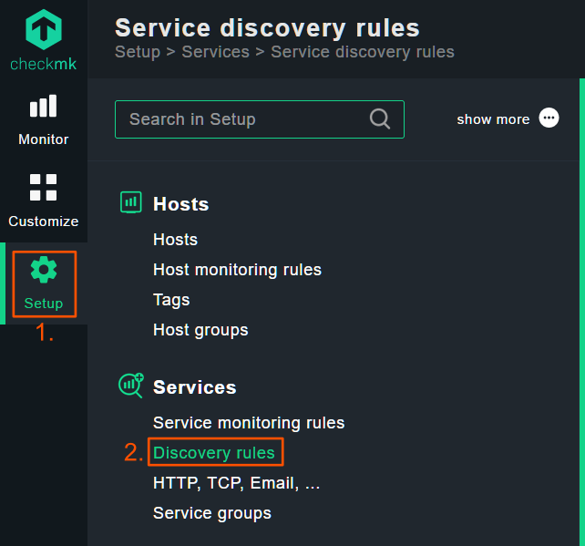
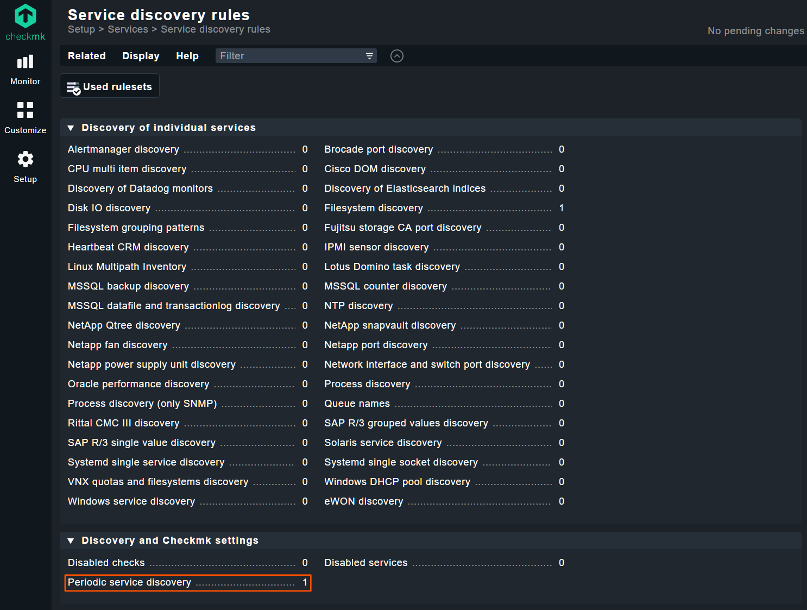
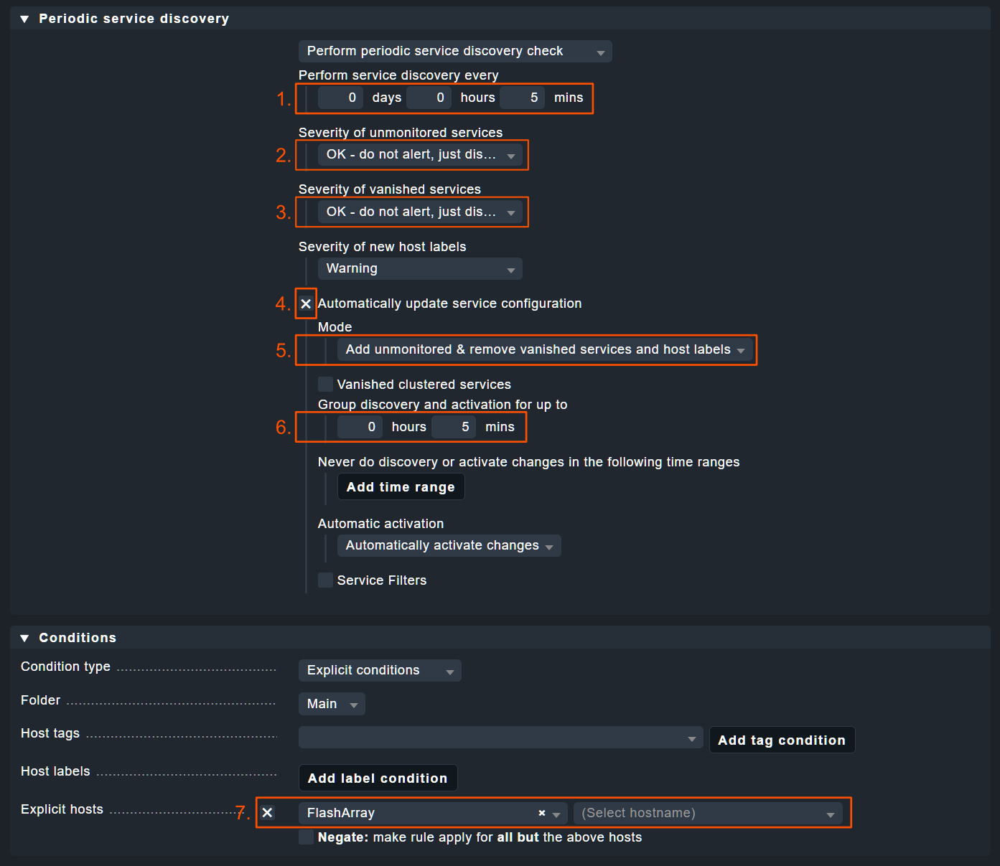

---
hide:
  - navigation
  - toc
---

# Setting up alerts reporting

Alerts are events happening in the FlashArray and FlashBlade devices that you may want to monitor. However, alerts are temporary entities and don't automatically fit into a traditional, service-based monitoring system. This page describes how you can integrate alerts reporting into Checkmk and get notifications similar to how you would get them for service outages.

## Step 1: enabling alerts as temporary services

When configuring your FlashArray/FlashBlade, you have the option to configure advanced settings by clicking `show more...` on the box with the connection settings. This exposes the following option (disabled by default):

<figure markdown>

</figure>

When you enable this option, the Checkmk plugin will create a new service for *each alert* issued by the device. Click the `Save` button on top of the page, then apply the changes by clicking the `1 change` indicator in the top right corner, followed by the `Activate on selected sites` button.

<figure markdown>

</figure>

!!! tip
    The services aren't removed immediately when the alert is closed. This allows for a recovery notification to be sent out. Make sure to keep the service long enough for this notification to go out.

## Step 2: Configuring periodic service discovery

Normally, when a new service appears in Checkmk an administrator must decide what to do with it. However, we want the alert-based services to be added automatically to the monitoring system so notifications can be sent from it.

To do this, please go to `Setup` &rarr; `Discovery rules`:

<figure markdown>

</figure>

Next, please click the `Periodic service discovery` option.

<figure markdown>

</figure>

Now, click the `Add rule` button on top of the page and create a rule with the following options changed:

| Option                                     | Value                                                                                           |
|--------------------------------------------|-------------------------------------------------------------------------------------------------|
| Perform service discovery every            | `5 minutes`                                                                                     |
| Severity of unmonitored services           | `OK`                                                                                            | 
| Severity of vanished services              | `OK`                                                                                            |
| Automatically update service configuration | `Yes`                                                                                           |
| Mode                                       | `Add unmonitored & remove vanished services and host labels`                                    |
| Group discovery and activation for up to   | `5 mins`                                                                                        |
| Explicit hosts                             | Select your Pure Storage devices here to limit the frequent service discovery to these devices. |

The screenshot below shows the correct configuration:

<figure markdown>

</figure>

Now save and activate the changes as before.

!!! tip
    You can configure a different service discovery interval, but it will change how quickly the alerts are reported. Keep in mind that service discovery is a relatively resource-intensive process.