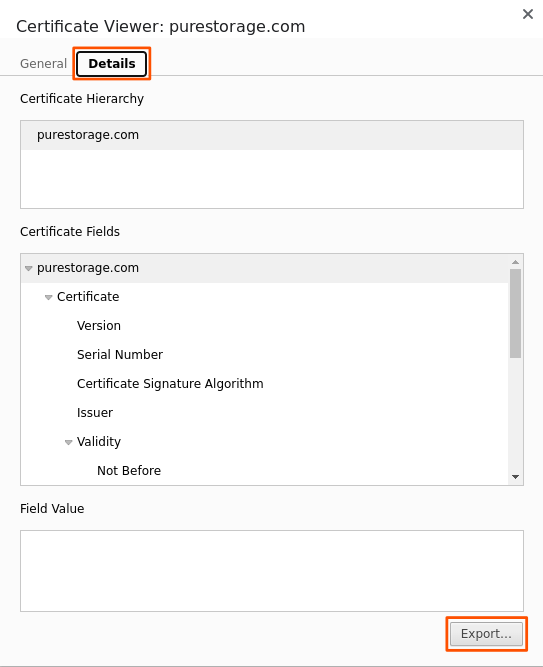

---
hide:
  - navigation
  - toc
---

# FlashBlade Checkmk Configuration Guide

## Setting up a host

In order to use the FlashBlade monitoring, first you need to set up a host. Please head to `Setup` &rarr; `Hosts` and
add a host. The form should be filled out as follows:

- `Hostname` **(required)**: Enter the hostname you want the FlashBlade to show up as. If you don't intend to provide an
  IP address,
  this hostname should be resolvable via DNS.
- `IP address family`: if your FlashBlade is reachable over IPv6, check the checkbox and change the setting
  to `IPv6 only` or `IPv4/IPv6 dual-stack`.
- `IPv4 address`: If your FlashBlade hostname is not resolvable via DNS, check the checkbox and enter the IPv4 address
  of the FlashBlade.
- `IPv6 address`: If your FlashBlade hostname is not resolvable via DNS, check the checkbox and enter the IPv6 address
  of the FlashBlade.
- `Checkmk agent / API integrations` **(required)**: Check the checkbox and change this setting
  to `Configured API integrations, no Checkmk agent`.

Now click `Save & run service discovery`.

## Setting up the API integration

Head to `Setup` &rarr; `Other integrations` and select `Pure Storage FlashBlade`.

<figure markdown>

</figure>

Now click the `Add rule` button and fill out the following fields:

- `API token` **(required)**: Enter your FlashBlade API token here.
- `TLS certificate verification` **(strongly recommended)**: This checkbox enables verifying that the connection is secure. *Disabling this may enable an attacker to capture your API keys.*
- `TLS certificate` **(required if verification is enabled)**: Paste the certificate of your FlashBlade if the TLS certificate verification is enabled. (See the hint below.)
- `Explicit hosts`: Limit this rule to the host you just created.

- ??? tip "Obtaining the certificate"
    Open the FlashBlade web interface and click the address bar of your browser. Select the certificate option.
    
    <figure markdown>
    
    </figure>
    
    Select the `Details` tab and click `Export...`.
     
    <figure markdown>
    
    </figure>

    Finally, open the downloaded file in a text editor and copy the contents.

!!! warning "Do not disable TLS certificate verification for production setups!"
    TLS certificate verification ensures that the connection between Checkmk and the FlashBlade is secure. Without it, an attacker can intercept the connection and obtain the API token for the device.

<figure markdown>

</figure>

## Advanced configuration

You can configure additional options by clicking the `show more ...` button on the `PureStorage FlashBlade` box. It opens up the following options:

| Option                                                        | Default   | Description                                                                                                                              |
|---------------------------------------------------------------|-----------|------------------------------------------------------------------------------------------------------------------------------------------|
| Port                                                          | `443`     | Port number to reach the FlashBlade on. Do not change this option unless you need the check to go through a reverse.                     |
| Certificate expiration checks / Custom warning threshold      | `90 days` | If the certificate expires in fewer than the specified number of days, the certificate check will switch to `WARN`                       |
| Certificate expiration checks / Custom critical threshold     | `30 days` | If the certificate expires in fewer than the specified number of days, the certificate check will switch to `CRIT`                       |
| Disk space checks / Custom warning threshold for arrays       | `80%`     | If the disk usage is more than this amount on the arrays, the check with switch to `WARN`                                                |
| Disk space checks / Custom critical threshold for arrays      | `90%`     | If the disk usage is more than this amount on the arrays, the check with switch to `CRIT`                                                |
| Disk space checks / Custom warning threshold for filesystems  | `80%`     | If the disk usage is more than this amount on the filesystems, the check with switch to `WARN`                                           |
| Disk space checks / Custom critical threshold for filesystems | `90%`     | If the disk usage is more than this amount on the filesystems, the check with switch to `CRIT`                                           |
| Disk space checks / Custom warning threshold for objectstore  | `80%`     | If the disk usage is more than this amount on the objectstores, the check with switch to `WARN`                                          |
| Disk space checks / Custom critical threshold for objectstore | `90%`     | If the disk usage is more than this amount on the objectstores, the check with switch to `CRIT`                                          |
| Hardware service name customization | N/A       | Here, you can customize how hardware services are reported. Specify the hardware type in the API to add a prefix and a suffix to the name. |
| Report alerts as temporary services                           | `off`     | If enabled, alerts from the FlashArray will be translated to temporary services. See [Alerts reporting](../alerts/index.md) for details. |
