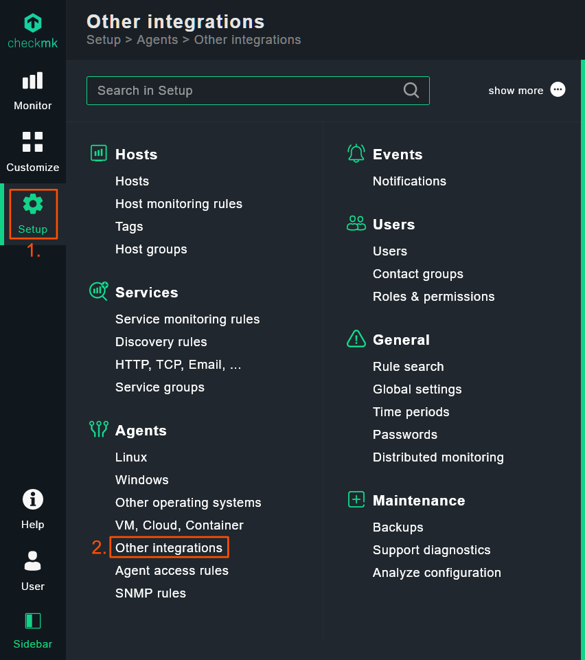
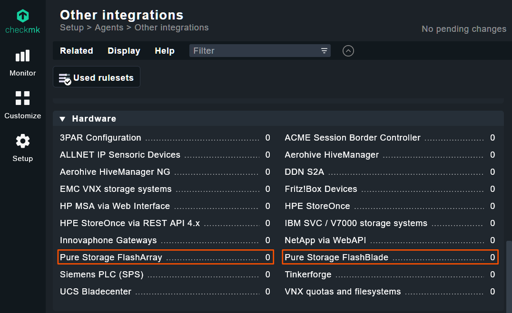

---
hide:
  - navigation
  - toc
---

# Installing the Pure Storage Checkmk plugin

## Downloading the plugin

You can download the plugin in MKP format from
the [GitHub Releases page](https://github.com/mkarg75/checkmk-purestorage/releases).

## Installing the dependencies

In order to use this plugin, you must install the `py-pure-client` library in your site. First, you have to enter your
site by typing:

```
root@yourserver# omd su yoursitename
```

You can then install the package:

```
OMD[yoursitename]:~$ python3 -m pip install py-pure-client
```

## Installing the plugin

If you have the Checkmk Raw Edition, you can use the `mkp` command line utility to install the plugin. First, you have
to enter your site by typing:

```
omd su yoursitename
```

You can then add the plugin:

```
OMD[monitoring]:~$ mkp add /path/to/purestorage.mkp
```

Finally, you can enable the plugin:

```
OMD[monitoring]:~$ mkp enable purestorage
```

!!! tip "Installing in an air-gapped environment"
    This plugin requires the `py-pure-client` library, which has several dependencies of its own. If you need to install this plugin in an air-gapped environment without internet connectivity, you can perform the following steps:

    1. Install Checkmk on a non-airgapped host and create a site.
    2. Switch to the newly created site by running `omd su yoursitename`
    3. Run `pip3 install py-pure-client`
    4. Copy the contents of `/omd/sites/yoursitename/local/lib/python3` to your airgapped environment.

## Verifying that the plugin is installed

You can find the plugin in the Checkmk dashboard of your site under `Setup` &rarr; `Other integrations`.

<figure markdown>

</figure>

You will now see the Pure Storage FlashArray and FlashBlade entries in the Hardware section:

<figure markdown>

</figure>

## Configuring the plugin

Please follow the respective guides for the [FlashArray](../flasharray/index.md)
and [FlashBlade](../flashblade/index.md) configuration.