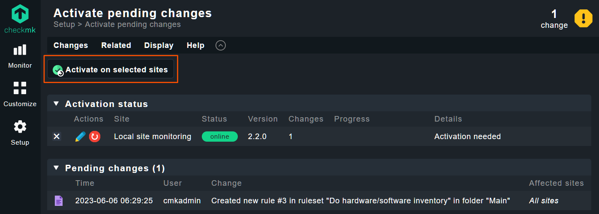

---
hide:
  - navigation
  - toc
---

# Enabling hardware/software inventory for Pure Storage devices

The Pure Storage Checkmk plugin comes with full support for hardware inventory. However, hardware inventory is not enabled in Checkmk by default. This page describes the steps you need to take in order to make the hardware inventory available for your Pure Storage devices.

!!! tip
    For more information about HW/SW inventory in Checkmk, please see the [official documentation](https://docs.checkmk.com/latest/en/inventory.html).

## Enabling hardware inventory

To enable hardware inventory, please head to `Setup` &rarr; `HW/SW inventory rules`.

<figure markdown>

</figure>

Then, click on `Do hardware/software inventory`:

<figure markdown>

</figure>

Here, you will see the rules shipped with Checkmk. The already existing rules don't cover your Pure Storage device, you you will need to add a new rule by clicking the `Add rule` button on top of the screen:

<figure markdown>

</figure>

Now you can configure the new rule to enable the inventory. Make sure that the `Status data inventory` option is enabled and set to `Do status data inventory`. Optionally, you may also want to configure the rule to only cover the Pure Storage hosts. When you are done, you can click the `Save` button to store the rule.

<figure markdown>

</figure>

Next, you need to make sure the changes are activated. Click the yellow icon in the top right corner indicating `1 change`:

<figure markdown>

</figure>

Now, click the `Activate on selected sites` button:

<figure markdown>

</figure>

## Viewing your inventory

To view your inventory, please click `Monitor` &rarr; `All hosts`:

<figure markdown>

</figure>

Now find your Flash Array or Flash Blade host and click the hamburger menu, then select `Show Hardware/Software inventory of this host`.

<figure markdown>

</figure>

**If you cannot find this menu item**, please wait for the inventory to finish. Alternatively, you can also reschedule the `Check_MK HW/SW Inventory` service on the host. To do this, click the pending service:

<figure markdown>

</figure>

Now select the hamburger menu on the inventory service and select the reschedule option:

<figure markdown>

</figure>

After a few minutes, you should be able to view the inventory on your host:

<figure markdown>

</figure>
